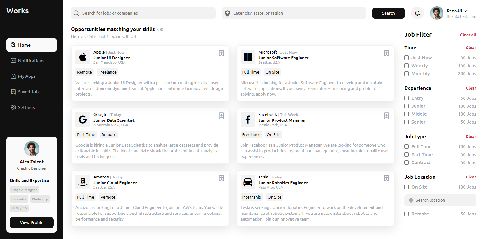

# Responsive Job Platform UI

🌟 Creating an Amazing Job Platform UI Design with HTML, CSS, and JavaScript! 🎨💻
([Open Video in Youtube](https://youtu.be/Cqofc2EeAMQ))

🎨 We’ll start by building the structure with HTML, then bring it to life with CSS for a modern and stylish look. Finally, we’ll use JavaScript to add interactive features that make the platform user-friendly. 
💻 From designing job listings to creating interactive search filters, we’ve got you covered!

What You’ll Learn:
- Structuring Your HTML: Setting up the foundation for your job platform with well-organized HTML.
- Styling with CSS: Designing a modern and attractive interface with CSS techniques for layout, colors, and fonts.
- Adding responsive menu with JavaScript.
- Creating a Responsive Design: Ensuring your job platform looks great on desktops, tablets, and smartphones.
- Custom Components: Building elements like job cards, search bars, sidebar and ...

Join us in this exciting project where you'll build a complete job platform UI from the ground up. Perfect for those looking to enhance their front-end skills or add a standout project to their portfolio. Let’s dive in and start designing your dream job platform! 🚀🎨

# Screenshot
Here we have project screenshot :

